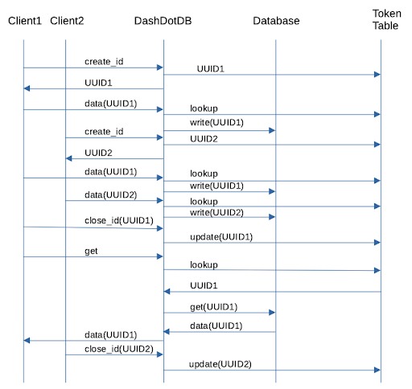

# Explict Tokens

## Terminology

Data bundle - A set of data for a data type uploaded via one or more POST operations that is versioned and can be retrieved as a whole.

Data type - The different kinds of data associated with a DashDotDB service (ie CSO, DVO, SLO, etc)

## Tracking:

The implementation will be tracked as part of this [jira](https://issues.redhat.com/browse/APPSRE-2910).

## Problem

DashDotDB uses a time based token to associate data together when it is committed to the database. This presents problems in at least two ways when adding data from multiple sources into DashDotDB.

If an upload of a complete set of data takes longer than the time allotted by the token (currently 1 hour), then a new token will be created for the remaining data.  This effectively means in this scenario doing a query on a token will result in only partial data.

If 2 different sources are updating data at the same time they will end up with the same token.  If the second upload starts significantly later than the first and takes a while to upload, then the data will only be partially uploaded when the token time expires.

## Proposal

The proposal is to add capabilities to DashDotDB to allow generating a unique token that will be used to associate all data from multiple post operations.  This would result in:

- New API endpoints per data type that allow creating and terminating a token that is used to upload a data bundle.  Each token is scoped to a specific data type. At a minimum this allows tracking of which token is the latest for a specific data type and allows DashDotDB to know what kind of data to expect for a token.
- New database tables tracking token metadata, including which token is the most current
- When a token is closed for new data, updating the appropriate table tracking tokens to indicate the recently closed token is the latest for a specific data type.  At this time, it handles CSO, DVO, and SLO data
- Having the query methods look at the token table to find the latest token for that data type and using that to retrieve the data from the DB
- Removing the time based token implementation

The identifier would be a UUID to ensure uniqueness.

## Implemenation

This imlementation allows multiple simultaneous data transfers for each data type to occur without restriction.  It would achieve the goals of the proposal with:

- When a token is created it will be written to a token table that contains all the created tokens for a data type as well as their state for accepting data and the timestamp of when the token was created
- All data POST operations would result in the provided token being checked against the token table to verify the identifier is valid and still open to accept data before writing the data to the database
- When a token is closed for data its status will be updated to be complete and marked as the latest token
- A separate process would look at the token table periodically and remove all tokens and data associated with them if the token is not closed and older than a specified period of time

MSC:

## Race Condition

There is a race condiation when completing data uploads.  If upload1 is started before upload2, but upload2 completes before upload1, then when upload1 gets completed it will be marked as the latest set of data even though upload2 is actually the latest.

### Options

When the token is written to the token table it would be written with the timestamp of when that token was created.  When a token is closed, DashDotDB would verify the newly closed token was created later than the current latest token before setting the closed token as the latest. If the closed token was created before the current latest token, then it will not be marked as the latest but still will be closed and unable to accept any new data.
