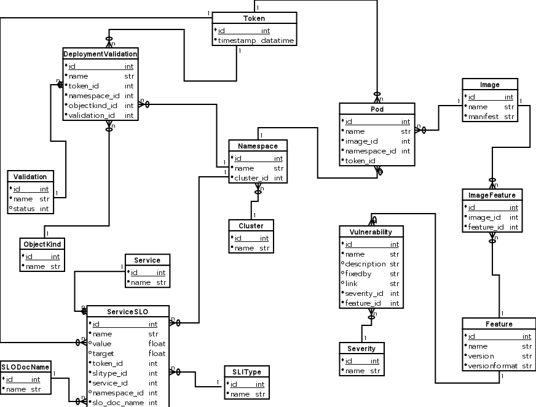

# Multi SLO Doc Support

## Date of Proposal

August 19, 2021

## Terminology

**SLO metric data** - 24-hour-snapshotted data points representing the values of SLO Prometheus queries. This data is stored in dashdotDB's underlying Postgres database.

## Tracking

Implementation is tracked through [this Jira ticket](https://issues.redhat.com/browse/APPSRE-3570).

For a high-level overview of the problem this proposal aims to address, in the context of the wholistic App-SRE toolset (dashdotDB, app-interface, qontract-reconcile, visual-qontract, etc), please see [this Jira comment](https://issues.redhat.com/browse/APPSRE-3570?focusedCommentId=18878164&page=com.atlassian.jira.plugin.system.issuetabpanels%3Acomment-tabpanel#comment-18878164).

## Problem

TODO

## Proposal

### Overview

The 'name' ([example](https://gitlab.cee.redhat.com/service/app-interface/-/blob/8bba50902109207d7e8a0b8f856bec92ede1e482/data/services/ocm/slo-documents/accounts-mgmt.yml#L7)) of SLO docs will be introduced as an identifier for the SLO metric data stored in dashdotdb. This will require a schema change to dashdotDB's underlying Postgres database.

TODO: example of json format

### Schema Changes

Here are three proposals for how a 'slo_doc_name' identifier can be introduced to the schema:

* [Option 1]: Update the 'ServiceSLO' table to include a 'SLODocName' column of type 'string'.
  * least effort proposal
  * acceptable data normalization
  * least disruptive to overall schema
* [Option 2]: Update the 'ServiceSLO' table to include a 'SLODocName' column of type 'integer', which is a foreign key to a new table 'SLODoc'. Table 'SLODoc' contains 'id' (primary key, integer), and 'name' (string, unique)
  * slightly more effort than 'Option 1'
  * superior data normalization over 'Option 1'
  * less disruptive to overall schema than 'Option 3'
* [Option 3]: Same as Option 2, and in addition: update all tables that currently have a relationship with table 'ServiceSLO' to instead have a relationship with 'SLODoc'
  * significantly more effort than 'Option 1' and 'Option 2'
  * superior data normalization over 'Option 1'
  * most disruptive overall schema change

### Schema Change Visualizations

Note bottom-left corners of digrams.

#### Option 1

TODO

#### Option 2

TODO

#### Option 3

TODO
