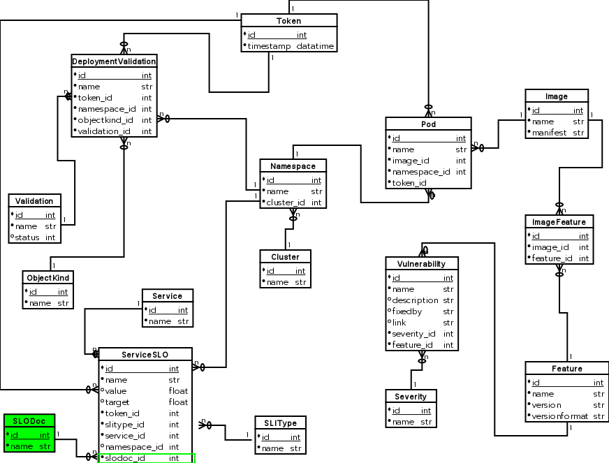

# SLO-Doc Tracking For SLO-metric-data

## Date of Proposal

August 19, 2021

## Terminology

* **SLO-metric-data** - 24-hour-snapshotted data points representing the actual observed values of SLO Prometheus queries. This data is produced by a qontract-reconcile integration, and is stored in dashdotDB's underlying Postgres database.

* **SLO-document** - Resources stored as app-interface data, and associated with services. [Example](https://gitlab.cee.redhat.com/service/app-interface/-/blob/32d546477e729e07bf33a46edce8ec44e6009e56/data/services/cincinnati/slo-documents/cincinnati.yml)

* **SLO-definition** - SLOs as defined in any 'SLO-document'. [Example](https://gitlab.cee.redhat.com/service/app-interface/-/blob/32d546477e729e07bf33a46edce8ec44e6009e56/data/services/cincinnati/slo-documents/cincinnati.yml#L13-23)

## Tracking

Implementation is tracked through [this Jira ticket](https://issues.redhat.com/browse/APPSRE-3570).

For a high-level overview of the problem this proposal aims to address, in the context of the wholistic App-SRE toolset (dashdotDB, app-interface, qontract-reconcile, visual-qontract, etc), please see [this Jira comment](https://issues.redhat.com/browse/APPSRE-3570?focusedCommentId=18878164&page=com.atlassian.jira.plugin.system.issuetabpanels%3Acomment-tabpanel#comment-18878164).

## Problem

Today, SLO-metric-data stored in dashdotDB has no context of the SLO-document that the SLO-definition originated from. The [ServiceSLO table](https://github.com/app-sre/dashdotdb/blob/f88048cd9156afa93a4a0448ecd088c551c8408d/dashdotdb/models/dashdotdb.py#L168) does not contain any direct or indirect reference to SLO-documents.

Consequently, if two (or more) SLO-definitions, spread across multiple SLO-documents, have identical names, service-ids, and namespace-ids, dashdotDB will not be able to store associated SLO-metric-data as desired. The SLO-metric-data values for these different SLO-definitions will effectively overwrite one another, and become indistinguishable when reading from the dashdotDB API.

## Proposal
The 'name' ([example](https://gitlab.cee.redhat.com/service/app-interface/-/blob/8bba50902109207d7e8a0b8f856bec92ede1e482/data/services/ocm/slo-documents/accounts-mgmt.yml#L7)) of SLO docs will be introduced as an identifier for the SLO-metric-data stored in dashdotdb.

The goals are:
* be able to store SLO-doc-names alongside SLO-metric-data using dashdotDB's `POST /api/v1/serviceslometrics/{name}` HTTP API
* be able to read SLO-doc-names alongside SLO-metric-data using dashdotDBs `GET /api/v1/serviceslometrics/metrics` and `GET /api/v1/serviceslometrics` HTTP APIs

## Implementation - HTTP API

---

[`POST /api/v1/serviceslometrics/{name}`](https://github.com/app-sre/dashdotdb/blob/4663b71f34b2c540f7163985b7eccae8e7a9b0f0/dashdotdb/schemas/swagger.yaml#L241-L264)

The JSON request body will now require a 'slo_doc.name' property.

Example:
```
{
    "name": "policy-engine-latency",
    "SLIType": "latency",
    "slo_doc": {
        "name": "policy-engine"
    },
    "namespace": {
        "name": "cincinnati-production"
    },
    "cluster": {
        "name": "app-sre-prod-04"
    },
    "service": {
        "name": "cincinnati"
    },
    "value": 66,
    "target": 99
}
```

---

[`GET /api/v1/serviceslometrics/metrics`](https://github.com/app-sre/dashdotdb/blob/4663b71f34b2c540f7163985b7eccae8e7a9b0f0/dashdotdb/schemas/swagger.yaml#L193-L207)

The objects within the JSON response body array will now include a 'slo_doc.name' property.

Example: *(same as above)*

---

[`GET /api/v1/serviceslometrics`](https://github.com/app-sre/dashdotdb/blob/4663b71f34b2c540f7163985b7eccae8e7a9b0f0/dashdotdb/schemas/swagger.yaml#L208-L240)

The JSON response body now includes a 'slo_doc.name' property.

Example: *(same as above)*

In addition, 'slo_doc' (type string) is added as a **required** query parameter. The rationale for this being required is to ensure clients are receiving only the data they expect to be receieving. Consequently, all clients (e.g. qontract reconcile) consuming this API must be updated to specify the 'slo_doc' query parameter.

---

## Implementation - Database Schema Changes

Update the 'ServiceSLO' table to include a 'slodoc_id' column of type 'integer', which is a foreign key to a new table 'SLODoc'. Table 'SLODoc' contains 'id' (primary key, integer), and 'name' (string, unique)
* consistant pattern with existing tables including 'ObjectKind', 'Service', 'Cluster', 'Severity', 'SLIType'


